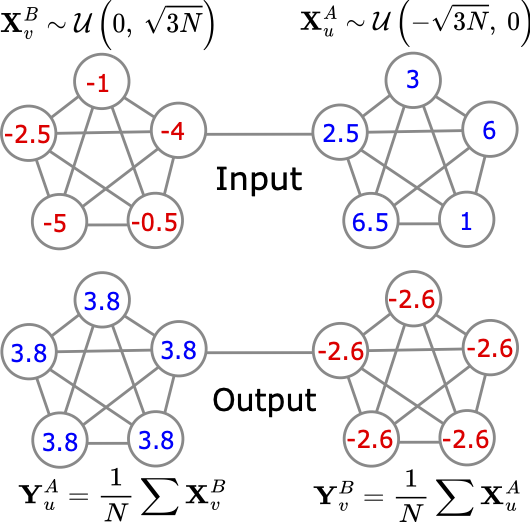

To run an experiment do the following from root:

<code> python -m newsynth.run_multiple --yaml_name name_of_config
</code>

where name_of_config should be in newsynth/configs.

So for example 

<code> python -m newsynth.run_multiple --yaml_name barbell-cheb.yml
</code>

Will loop over the grid defined by the parameter lists and record the results in wandb. The num_seeeds param defines how many seeds to run for, and after all jobs are ran, it will aggregated the results in another wandb run with a name including 'final' as prefix. 

## Barbell task for oversquashing:

The Barbell task is designed for over-squashing. The data generation is in data/utils/barbell.py and then the main file is run.py to run. For a precise description of the barbell task see the barbell.pdf file.