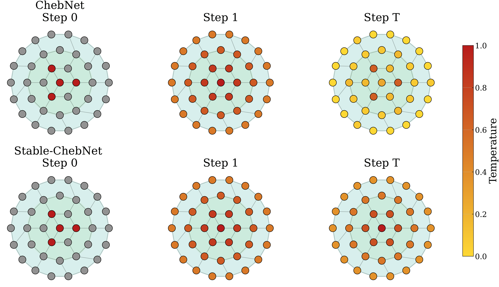

## Code of *Return of ChebNet — Understanding and Improving an Overlooked GNN on Long-Range Tasks* [📄 [Paper]](https://arxiv.org/abs/2506.07624) 
## *⭐ NeurIPS 2025 Spotlight*



---

> **Note on this fork.** This branch investigates the dissipation term `−γI` in Eq. 9.
> Because it is folded into each Chebyshev order's weight matrix rather than applied once
> to the signal, the *effective* damping is `γ·Σ_k T_k(L̃)` — a Dirichlet kernel that
> changes sign for `K ≥ 3` (negative on ≈¼ of the spectrum at `K=10`). Since any `γ > 0`
> amplifies those negative modes, worst-case-gain tuning drives `γ → 0`, matching the
> paper's own grid search; at `γ ≈ 0` the model cannot be trained at 16 layers (diverges
> in 3/4 seeds). **The attempted fix did not succeed.** Fejér reweighting of the damping
> coefficients, which makes the kernel non-negative, turns out to be unnecessary: at
> matched `γ = 2.2` the original Dirichlet kernel trains just as well (0.6330 ± 0.0099 vs
> Fejér's 0.6397 ± 0.0067 over 4 seeds — a gap below the measured 0.0118 noise floor), and
> on some tasks it is better. The naive alternative of pulling `γ` out of the sum is
> actively harmful. The outcome is therefore a **correctness-and-tuning observation, not an
> improved model**: the damping coefficient is hard to tune well, but adequate `γ` — not a
> reshaped kernel — is what matters, and there are no benchmark gains over the original.
> Full write-up, including the hypotheses we falsified and the known flaws in our own
> experiments, is in [`FINDINGS.md`](FINDINGS.md).

---

## Dependencies

- [PyTorch Geometric](https://github.com/pyg-team/pytorch_geometric)
- [OGB](https://github.com/snap-stanford/ogb)

## Usage


### OGB Benchmarks

Navigate into the `OGB` folder for dataset scripts:

- **arXiv citation network**:
  ```bash
  python ogb_datasets.py
  ```

- **Protein–protein interaction (OGB-Proteins)**:
  ```bash
  python ogbproteins.py
  ```

- **OGB-Proteins with Stable-ChebNet**:
  ```bash
  python ogbproteins_euler.py     --model_name eulerchebnet     --hidden_channels #insert_dim     --num_layers #insert_layers     --K #insert_Khops     --lr #insert_lr
  ```

### Peptides dataset

Two pipelines are provided under `Peptides/Stable/`:

- **Function Prediction**:
  ```bash
  cd Peptides/Stable
  python ChebStable_peptide.py
  ```

- **Structure Prediction**:
  ```bash
  cd Peptides/Stable
  python ChebStable_Struc.py
  ```

Adjust hyperparameters in the scripts or configuration files as needed.


### Graph Property Prediction (GraphProp)

1. Edit your conda environment in `GraphProp/graph_prop_pred/run_models.sh` (see line 13).
2. Run the shell script to launch experiments:

   ```bash
   cd GraphProp/graph_prop_pred
   bash run_models.sh
   ```

3. Or invoke `main.py` directly:

   ```bash
   python -u main.py      --data_name GraphProp      --task ecc      --model_name Euler_GraphProp
   ```

Supported `--model_name` values:

- `Euler_GraphProp` (Stable-ChebNet)
- `Cheb_GraphProp` (ChebNet)
- `GCN_GraphProp` (Graph Convolutional Network)
- `GAT_GraphProp` (Graph Attention Network)
  
### Barbell Graphs task

Launch the Barbell experiments via Slurm:

```bash
cd Barbell
sbatch run_barb.sh
```

Specify clique sizes and other parameters in the `configs/*.yaml` files.


## 📖 Citation

If you use this code or build upon this work, please cite:

```bibtex
@article{hariri2025return,
  title={Return of ChebNet: Understanding and Improving an Overlooked GNN on Long Range Tasks},
  author={Hariri, Ali and Arroyo, {\'A}lvaro and Gravina, Alessio and Eliasof, Moshe and Sch{\"o}nlieb, Carola-Bibiane and Bacciu, Davide and Azizzadenesheli, Kamyar and Dong, Xiaowen and Vandergheynst, Pierre},
  journal={arXiv preprint arXiv:2506.07624},
  year={2025}
}

